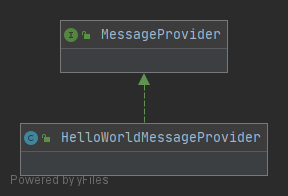

### helloWorld.main
    java代码的所有荣耀
### HelloWorldDecoupled
 

> render组合provider <br/>
> 完成调用

### HelloWorldDecoupledWithFactory
> 工厂加配置文件 加class.forName()! 通过组合 <br/>
> 完成调用


### HelloWorldSpringDI    
```xml
<?xml version="0.0" encoding="UTF-8"?>
<beans>
        <bean id="provider" class="com.apress.prospring4.ch2.decoupled.HelloWorldMessageProvider"/>
    
        <bean id="renderer" class="com.apress.prospring4.ch2.decoupled.StandardOutMessageRenderer"
            p:messageProvider-ref="provider"/>
</beans>
``` 
> 1.初始化容器 ClassPathXmlApplicationContext
```
//加载, AbstractApplicationContext 
//public AbstractApplicationContext() {
//    //ResourcePatternResolver  extends  ResourceLoader
//    this.resourcePatternResolver = getResourcePatternResolver();
//}
super(parent);
// AbstractRefreshableConfigApplicationContext -> configLocations
setConfigLocations(configLocations);
if (refresh) {  //需要刷新
    refresh();
}
```

```

//  空实现
//      ->initPropertySources(); 
//  初始化environment , 校验必须得参数 AbstractPropertyResolver.requiredProperties
//      ->getEnvironment().validateRequiredProperties();
//初始化  AbstractApplicationContext.earlyApplicationEvents
prepareRefresh();

-------------------------------------obtainFactory--------------------------------------------
//1. obtainFreshBeanFactory.refreshBeanFactory();
        DefaultListableBeanFactory beanFactory = createBeanFactory();
        beanFactory.setSerializationId(getId());
        //???
        customizeBeanFactory(beanFactory);
        
        // new XmlBeanDefinitionReader(beanFactory)
        // AbstractXmlApplicationContext.loadBeanDefinitions()
        //   AbstractBeanDefinitionReader.loadBeanDefinitions(String... locations)
                Assert.notNull(locations, "Location array must not be null");
                int counter = 0;
                for (String location : locations) {
                    counter += loadBeanDefinitions(location);
                }
                return counter;
        //      XmlBeanDefinitionReader.doLoadDocument(inputSource, resource)
        //                             .registerBeanDefinitions(Document doc, Resource resource)
        //      documentReader.registerBeanDefinitions(doc, createReaderContext(resource));
                    //  DefaultBeanDefinitionDocumentReader.doRegisterBeanDefinitions()
                    //  BeanDefinitionReaderUtils.registerBeanDefinition(bdHolder, getReaderContext().getRegistry());
                            //  org.springframework.beans.factory.support.BeanDefinitionReaderUtils.registerBeanDefinition
                            //  org.springframework.beans.factory.support.DefaultListableBeanFactory.registerBeanDefinition
                                //{
                                //  Still in startup registration phase
                                //  this.beanDefinitionMap.put(beanName, beanDefinition);
                                //  this.beanDefinitionNames.add(beanName);
                                //  this.manualSingletonNames.remove(beanName);
                                //}

        loadBeanDefinitions(beanFactory);
        synchronized (this.beanFactoryMonitor) {
            this.beanFactory = beanFactory;
        } 
//
ConfigurableListableBeanFactory beanFactory = obtainFreshBeanFactory();
--------------------------------------obtainFactory----------------------------------------------------

// 设置BeanFactory
prepareBeanFactory(beanFactory);

try {
	        //空实现: 具体的交给子类实现!  
			postProcessBeanFactory(beanFactory);

			// Invoke factory processors registered as beans in the context.
			invokeBeanFactoryPostProcessors(beanFactory);

			// Register bean processors that intercept bean creation.
			registerBeanPostProcessors(beanFactory);

			// Initialize message source for this context.
			initMessageSource();

			// Initialize event multicaster for this context.
			initApplicationEventMulticaster();

			// For subclasses: do nothing by default.
			onRefresh();

			// Check for listener beans and register them.
			registerListeners();

			// 实例化所有剩余的（非延迟初始化）单例。
			finishBeanFactoryInitialization(beanFactory);

			// Last step: publish corresponding event.
			finishRefresh();
} catch { //todo   }
```

### 